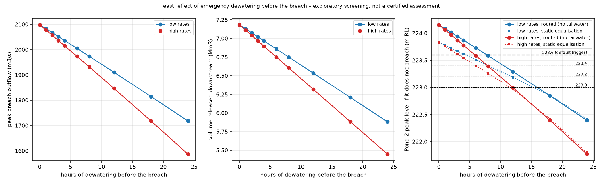

# Dewatering before a breach – exploratory drawdown sensitivity

**Status: exploratory, not part of the published results.** Nothing in the main pipeline (scripts 01–10),
`config/dam.yaml`, the viewers or `RESULTS.md` depends on this. Screening model, not a certified assessment.

Question: if the operator starts emergency dewatering some hours before the embankment fails, how much
does that change the breach outflow? This is step 1 of the tree-shelter / water-race idea: it only uses the
level-pool breach routing (no 2D run), to see whether the dewatering case is worth carrying into ANUGA.

## Method

* Rates: EAP Issue 6 Table F.1 examples ([dewatering-pathway-evidence.md](dewatering-pathway-evidence.md)) –
  **low** 4 m³/s (Pond 1, MR4) + 11 m³/s (Pond 2, R2/R3); **high** 5 + 15 m³/s. As-built capacities are unknown.
* Both ponds start at FSL, are drawn down at a constant net rate for 0–24 h, then the scenario's breach is routed
  exactly as in `scripts/03_breach_hydrograph.py` (same Froehlich 2008 geometry rules, weir coefficients, breach
  invert read from the scenario's `breach_summary.json`). The 0 h case reproduces the published east hydrograph
  (2,098 m³/s, 7.18 Mm³) – covered by a test.
* For the cascade, Pond 2's peak level *if it does not breach* is reported two ways: **routed** as the pipeline
  does (no tailwater: Pond 1 always drains to the 222.8 m dividing-breach invert – upper bound) and **static
  equalisation** of the two ponds (full tailwater control – lower bound; 223.83 m RL at FSL, the ~223.8 noted in
  `config/dam.yaml`).
* Dewatering is assumed to stop when the breach starts; inflow from the main race is assumed closed.

Run: `python scripts/11_dewatering_sensitivity.py --scenario east` (about 20 s) → `outputs/dewatering/<scenario>/`.
Settings: `config/dewatering.yaml`. Code: `damflood/dewater.py`. Tests: `tests/test_dewater.py`.

## Results

### East (cascade: Pond 1 → Pond 2 → east embankment)

**Working assumption (default): Pond 2 still fails.** If the drawn-down ponds no longer reach the 223.6 m
trigger, the breach is assumed to initiate at a correspondingly lower level – 0.56 m below the peak level
Pond 2 would reach unbreached, which is where 223.6 sits for full ponds (224.16 routed). The breach is sized
(Froehlich 2008) for that lower pool.

| Dewatering (high rates) | Removed | Pond 1 / Pond 2 level | Breach initiates at | Peak Q | Released |
|---|---|---|---|---|---|
| 0 h | 0 | 226.50 / 222.80 | 223.60 | 2,098 m³/s | 7.18 Mm³ |
| 3 h | 0.22 Mm³ | 226.32 / 222.57 | 223.32 | 2,036 m³/s (−3 %) | 6.97 Mm³ |
| 6 h | 0.43 Mm³ | 226.14 / 222.35 | 223.03 | 1,973 m³/s (−6 %) | 6.75 Mm³ |
| 12 h | 0.86 Mm³ | 225.77 / 221.88 | 222.44 | 1,847 m³/s (−12 %) | 6.32 Mm³ |
| 24 h | 1.73 Mm³ | 225.01 / 220.92 | 221.21 | 1,587 m³/s (−24 %) | 5.45 Mm³ |

Low rates: 2,005 m³/s after 6 h, 1,910 after 12 h, 1,718 after 24 h. Timing is unchanged (initiation ~2.2 h,
peak ~3.3 h after Pond 1 starts to fail).

Reading: **if the ponds fail anyway, several hours of dewatering hardly change the breach flood** – about −1 %
of the peak and −0.07 Mm³ per hour. The breach hydrograph for a "dewater 6 h, then east breach" 2D run is
therefore nearly the existing east hydrograph; what differs is the state of the land it runs onto (full races,
spill at culverts, wet ground) – which is the part only the 2D model can show.

**Alternative (`--fixed-trigger`): the trigger stays at its level**, so enough dewatering prevents the Pond 2
failure altogether (`*_fixed_trigger.*` outputs). Hours of dewatering needed to keep Pond 2 below the trigger,
for the routed (no tailwater, upper) and static-equalisation (lower) bounds on the Pond 2 level:

| Trigger (m RL) | low rates, routed | low, equalised | high rates, routed | high, equalised |
|---|---|---|---|---|
| 223.6 (project default) | 7.8 h | 4.3 h | 5.8 h | 3.2 h |
| 223.4 | 10.5 h | 8.0 h | 7.9 h | 6.0 h |
| 223.2 | 13.2 h | 11.7 h | 9.9 h | 8.8 h |
| 223.0 | 15.9 h | 15.3 h | 11.9 h | 11.5 h |

This rides entirely on `cascade.pond2_trigger_mRL` (SPEC §3.1). Pond 2's crest is 224.3 m RL; neither bound
reaches it even with no dewatering (224.16 / 223.83), so the trigger stands in for surge/wave overtopping or a
piping failure under raised head.

### West (Pond 1 piping only, no cascade)

Lower head and volume only, no threshold: peak 235 m³/s at 0 h → 204–210 m³/s after 6 h → 175–186 m³/s after
12 h → 121–141 m³/s after 24 h (high–low rates). Roughly −2 % of the peak per hour of dewatering.

## Is it worth carrying into the 2D model?

Yes, but not for the breach hydrograph (nearly unchanged). The 2D question is what 15–20 m³/s down MR4 / R2 / R3
for hours does on its own (race overtopping at culverts – the EAP App. F.6 maps that were never published), and
whether full races and wet ground change where and how fast the breach wave then travels. That needs the race
channels and culverts in the mesh (plan step 3). For the CLG: would the operator get hours of warning, and do the
gates and races really pass 15–20 m³/s (clg-notes point 1)?

## Limitations

Constant dewatering rates regardless of head; linear stage–area pond geometry; the Buffer Pond, Tub and spillways
are ignored; no tailwater in the routed bound; the breach is assumed to start on schedule regardless of the lower
pool (a piping failure may well slow or stop as the head falls – not modelled).
