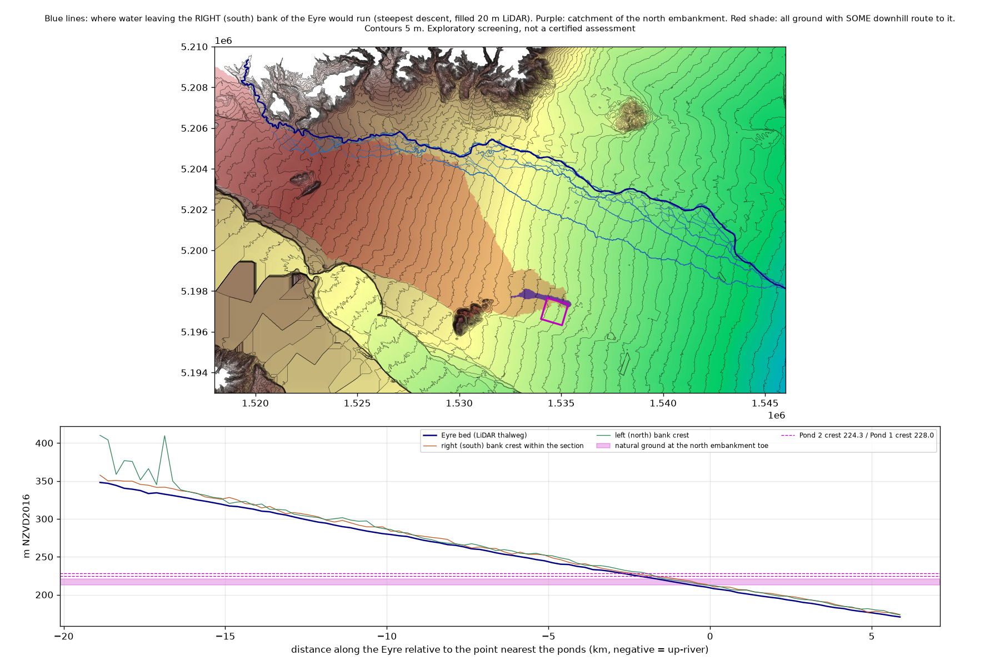
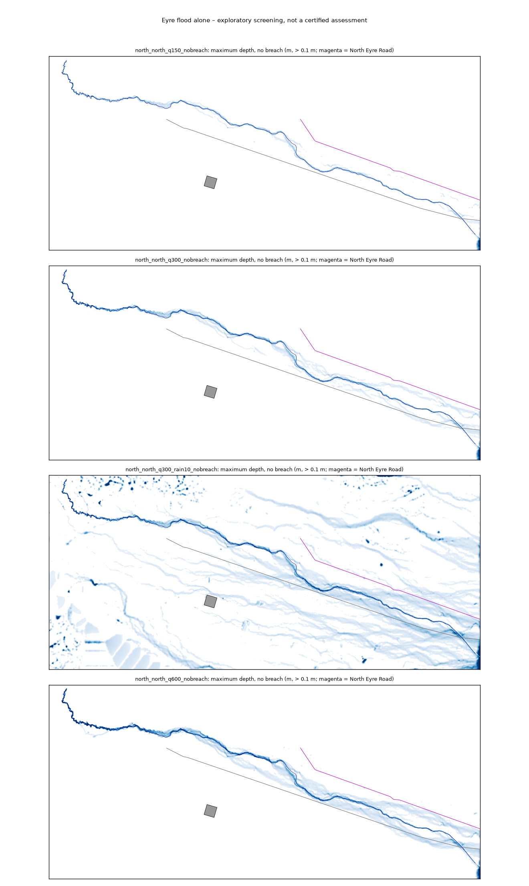
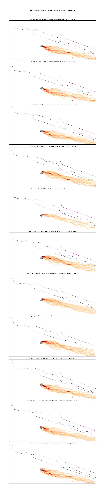
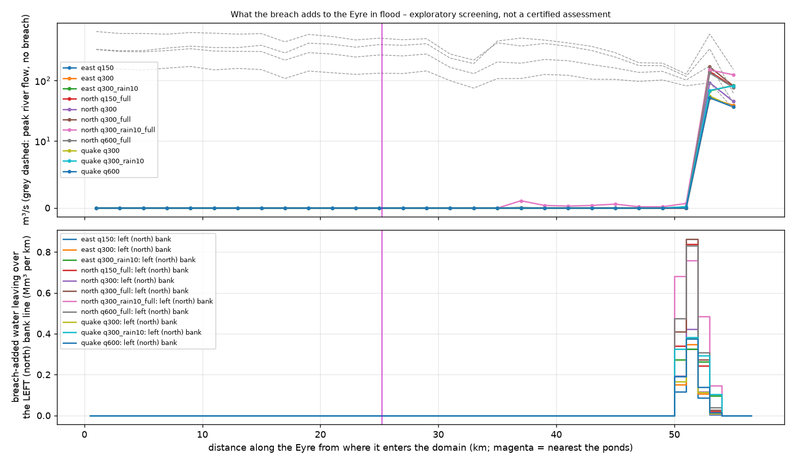

# An Eyre River flood at the north embankment – and what a breach would add to it

**Exploratory screening, not a certified assessment.** Kept apart from the pipeline (scripts 01–10), `RESULTS.md` and the
published viewers like the other exploratory work ([wet-worstcase-trees-races.md](wet-worstcase-trees-races.md) §6 left this
question open). 20 Sep 2026.

The question: *what happens if an Eyre River flood reaches the ponds' north embankment – and what does a breach (north
embankment, east cascade, or the earthquake multi-breach) add to that flood?* The design report (Damwatch, Issue 6, s3,
PDF p32) cites preliminary Waimakariri District Council flood mapping showing that a major Eyre flood "would extend to the
North embankment of the ponds", and concludes it would not endanger them. [clg-notes.md](clg-notes.md) point 3 describes
the one chain that was not impossible: Eyre flood at the north embankment → north embankment fails into it → the combined
flow overtops the Eyre's low north bank towards North Eyre Road.

## Short answers

| Question | Answer (screening level) |
|---|---|
| Can Eyre River water reach the north embankment? | **Not in the LiDAR terrain and not in the 2D model, at any flow tried (150, 300, 600 m³/s).** The ponds sit on a ridge of the old Waimakariri fan; the ground falls from them TOWARDS the Eyre, which runs 5.7–7 km away in the low between that fan and the Ashley / Cust side. Water leaving the Eyre's south bank runs east-south-east parallel to the river and never comes closer than 3.5 km (terrain paths) / **4.9 km (2D, 600 m³/s)** to the embankment. Depth of river water against the north embankment: **0.0 m in every run.** |
| So what did the council mapping in the design report show? | We do not have it (request drafted – [eyre-flood-information-requests.md](eyre-flood-information-requests.md)). The councils' CURRENT published flood model is rain-on-grid with no Eyre River scenario; along the north embankment it shows local rainfall ponding of 0–0.3 m in the 100- to 500-year storms (median 0 – 0.09 m). The likeliest reading is that the water "at the north embankment" is local runoff collecting along Dixons Road, not the river. The upslope catchment of the north embankment is tiny: **0.7 km²**. |
| Is there ANY route from the Eyre to the embankment? | Only in the loosest sense: 85 km² of fan surface west of the ponds has *some* downhill path to the embankment, and that surface touches the Eyre's south bank 8–19 km up-river, near Oxford (E 1521–1530 km). There the river is incised; spreading one unit of overflow from each of those bank points over every downhill neighbour delivers effectively nothing (< 10⁻²⁰) to the embankment, and the 2D runs with the river entering at the foothills leave that surface dry. |
| How big is an Eyre flood? | No flood-frequency estimate for the Eyre on the plains could be found. The only recorder is a headwater site (18.7 km²; mean annual flood 15 m³/s). NIWA's regional method gives **≈ 148 m³/s for the 1 % AEP flood** north of the ponds (standard error ≈ ±55 %), 206 m³/s for 0.1 % AEP; ECan's highest plains gaugings are **292 and 266 m³/s** near South Eyre Road. We therefore ran 150 (≈ 1 % AEP, regional estimate), 300 (≈ largest gauging) and 600 m³/s (a bounding doubling) – the last two are SENSITIVITY values without a return period. The old A10 value (150 m³/s) turns out to be about the regional 1 % AEP figure. |
| Where does the Eyre leave its banks on its own? | Already at 150 m³/s the model spills 4.6 Mm³ over the left (north) and 3.0 Mm³ over the right (south) bank line, mainly at river km 13–15 (left bank, E 1526.8–1527.6 km, just above the McGraths Road ford), at km 30–32 (both sides, Steffens Road to Wolffs Road – the tight reach found earlier, where R3 joins) and at km 50–52 (above South Eyre Road). At 300 / 600 m³/s: 13 / 37 Mm³ left and 8 / 23 Mm³ right. **North Eyre Road is wet from the river alone**: 0.08 / 0.16 / 0.29 m at 150 / 300 / 600 m³/s. This is an Eyre River matter with or without the dam – consistent with the May 2021 evacuation from Wolffs Road to North Eyre Road. |
| What does a breach add to the river flood? | **Nothing up-river of km 53** (South Eyre Road, 28 km of river below the ponds): breach water – north, east or all embankments – runs east-south-east on the south side of the river and meets it only in its last ~3 km before the domain edge by the Eyre Diversion. There (300 m³/s flood): north breach +92 m³/s, north full-depth +169 m³/s, east cascade +51 m³/s, earthquake +56 m³/s on a river corridor whose own peak there is ~175 m³/s; peak flood level up by **≤ 0.25 / 0.33 / 0.22 / 0.22 m** over 1.2–3.6 km of river; +0.6 to +1.6 Mm³ over the left (north-east) bank line on top of 2.2 Mm³ that leaves there in the river flood alone. **No reach spills only because of a breach.** |
| Does a north breach put water on North Eyre Road? | **No.** Breach-added depth on North Eyre Road is 0.0 m in every case, including the full-depth north breach (2,100 m³/s). The north-breach water turns east within about a kilometre of Dixons Road (the plain falls east-south-east at ~6 m/km) and runs down the same corridor as the east breach, south of South Eyre Road and parallel to the river, which it meets only near the Diversion (maps in §5). |
| What is the chain of CLG point 3 worth now? | Its first link fails: the river does not reach the embankment, so "the north embankment fails into the flooded foreground" has no flooded foreground. A north breach during an Eyre flood behaves like a north breach on a dry day until its water meets the river near the Diversion, where it adds ≤ 0.33 m to a flood that is already out of bank. |

Rain on top (10 mm/h, no infiltration – A9; §5): the rain – not the river – puts up to 0.12 m of water 40 m outside the north
embankment and 0.35 m at 150 m outside, the same order as the councils' rain-on-grid model. With rain the breach floods travel
faster (Diversion Road 5.5–5.9 h) but raise the river LESS (0.17–0.22 m); breach-added depth on North Eyre Road stays ≤ 0.01 m.

**Not modelled, and not answered here:** embankment stability under external water, seepage or uplift under the liner,
erosion of the embankment toe by flowing water, stopbank erosion or failure on the Eyre, debris, bridges and culverts.
The model only says where water goes and how much. "The river does not reach the embankment" is a statement about terrain
and hydraulics on 2020–25 LiDAR, not about dam safety.

## 1. What was done

1. **Sources** for Eyre flood flows (§2) and drafted official-information requests for what could not be found.
2. **Terrain check without a 2D model** (`scripts/23_eyre_north_terrain.py`, §3): LiDAR cross-sections of the Eyre for 25 km
   (19 km above to 6 km below the point nearest the ponds; the capacity functions of `scripts/20_eyre_capacity.py`),
   steepest-descent paths of bank overflow over the depression-filled 20 m LiDAR, the upslope area of the north embankment,
   and levels at the embankment toe.
3. **New domain** (`config/north.yaml`, `scripts/22_north_domain.py`): bbox `[1518000, 5187000, 1562500, 5210000]`
   (44.5 × 23 km; the full domain of `site.yaml` is `[1531000, 5187000, 1562500, 5203000]`) – west to where the Eyre leaves
   the foothills above Oxford, because the terrain check showed that the only ground draining towards the embankment lies
   WEST of the ponds; north to N 5210 km so North Eyre Road and the river's north bank are inside. Own DEM
   (`data/derived/dem_north_20m.tif`, 20 m from the LINZ / ECan Canterbury 1 m LiDAR 2020–25) and OSM extract
   (`data/raw/osm_north.gpkg`). **LiDAR coverage:** no gaps in the new northern and western ground; the only gap
   (90 km², 8.8 % of the bbox) is the corner south-west of the Waimakariri River, which no modelled water reaches
   (`outputs/north_eyre/dem_gaps.json`; the standard fetch fills gaps silently, the new one writes a gap mask).
4. **2D runs** (`scripts/24_run_north_eyre.py`, §4–5): as the wet worst case (script 18: pond block, site / corridor /
   Eyre-strip refinement, n = 0.045, breach inlets delayed by the spin-up) plus a refined "foreground" polygon over the fan
   surface between Oxford and the embankment; **417,361 triangles, one mesh for every run**. The river enters 500 m inside
   the domain as a **hydrograph**: base flow 5 m³/s, gamma-shaped rise to the peak 5 h after the start, recession after it
   (150 / 300 / 600 m³/s peaks = 4.2 / 8.2 / 16.3 Mm³ in 20 h). The breach opens 8 h after the start – when the flood peak is
   passing the reach beside the ponds (checked: 8.0 h at river km 25) – and the run continues 12 h. Every breach run is paired with the same flood without
   the breach; everything "added by the breach" is that difference (as HANDOVER §8.5). ~1¾ h per run, eight in parallel.
5. **Report** (`scripts/25_north_eyre_report.py`): gauges 40 m and 150 m outside the north embankment, discharge through
   Eyre cross-sections every 2 km and over bank lines ±250 m from the centreline (`damflood.wet.Transects`), rise of the
   peak level in the river, breach-added area / buildings / road arrivals.

## 2. What is known about Eyre River floods (sources checked 20 Sep 2026)

| Item | Value | Source |
|---|---|---|
| Flow recorders | **One:** "Eyre River at Trig Road Ford", site 166405 (ECan report R16/68 calls it Trigpole Road Ford), NZTM 1519705 / 5208138, 398 m, telemetered, flow. Catchment 18.7 km² (REC). 165 gaugings 2003–2026, **highest gauged flow 8.4 m³/s** – every flood value is rating extrapolation. "Eyre at Downs Road", "Poyntz Road" etc. are manual low-flow gauging sites; "Eyrewell" is a weather station. | ECan layer "River Flow and Stage Monitoring – Live": `https://gis.ecan.govt.nz/arcgis/rest/services/Public/WaterQualityandMonitoring/MapServer/12` (gauging sites: layer 4) |
| Record | Public download from 9 Sep 2015, 5-min: `https://data.ecan.govt.nz/data/79/Water/River%20stage%20flow%20data%20for%20individual%20site/CSV?SiteNo=166405&Period=All&StageFlow=River%20Flow` (CC BY). R16/68 p29/p33: record from 4 Aug 2009, none Dec 2011 – Sep 2015. | ECan data portal; R16/68 (Megaughin & Hayward 2016) `https://apps.canterburymaps.govt.nz/WaimakStoryMap/images/WZ%20Sub%20Regional%20Hydrology%20Current%20State.pdf` |
| At-site statistics | Mean annual flood 15 m³/s, 1-in-10-year flood 27 m³/s (method and record length not stated). Largest in the download: 31.9 m³/s on 30 May 2021 (our reading of the data, not an ECan statistic). | `https://www.ecan.govt.nz/data/riverflow/sitedetails/166405` |
| **Regional flood-frequency estimate** (Henderson & Collins 2018, NIWA; regression, not gauged) | Reach due north of the ponds (NZREACH 13038732, 118.6 km²): mean annual flood 47, 10-yr 89, 50-yr 131, **100-yr 148**, 1000-yr 206 m³/s; standard error of the 100-yr value 82 m³/s. Depot Gorge Road (Oxford) 117.8 km²: 148. Poyntzs Road 156.6 km²: 180. Two Chain Road 178.6 km²: 196. South Eyre Road 186.1 km²: 202. No 200- or 500-year values are published. | NIWA "NZ Flood Statistics – Henderson Collins V2" feature service: `https://services3.arcgis.com/fp1tibNcN9mbExhG/arcgis/rest/services/NZ_Flood_Statistics_Henderson_Collins_V2_REC1_Layer_WFL1/FeatureServer/0` (queried by us) |
| Largest measured flows on the plains | **292.3 m³/s** at "Eyre River at Cross-section IM40" (site 824, 2 gaugings 1962–63) and **266.0 m³/s** at "Eyre River at South Eyre Road" (site 277, 67 gaugings 1985–2024); 106 m³/s at the Eyre Diversion (site 822). Dates of the individual gaugings are not published. Both exceed the regional 1000-year value there (283) – the regional estimate may run low, or those floods were very rare; undecidable without the gauging dates. | ECan layer 4 "River Gaugings" (queried by us) |
| Whole catchment | ≈ 210 km²; the river is "generally dry by Oxford" and loses flow to groundwater across the plains. | R16/68 p33, p55 |
| Floods | 29–31 May 2021: Eyre and Cust "flowing at 'bank-full' levels"; WDC told residents from Wolffs Road and north of the river to North Eyre Road to evacuate because the Eyre stopbanks were expected to fail. April 1951: the Eyre "had broke its banks in several places". 1868, 1905: Eyre and Cust floods inundated Kaiapoi. No peak flows published for any of them. | ECan "Canterbury 2021 Flood Recovery Update 1" `https://api.ecan.govt.nz/TrimPublicAPI/documents/download/4500740`; RNZ 31 May 2021; NIWA Historic Weather Events; ECan R16/36 p10 |
| Eyre Diversion | The Eyre was diverted into the Waimakariri **in 1929** (not the 1860s, as clg-notes point 3 said until today). Design capacity not found. Rating district "Waimakariri-Eyre-Cust Rivers", "Defined Flow Stopbanked" – the defined flow for the Eyre was not found. | ECan R05/15 (Hudson 2005) PDF p9 `https://webstatic.niwa.co.nz/library/ECtrR05-15.pdf`; ECan Rating_Areas layer 8 |
| Council flood models | WDC / DHI "Flood Hazard Models Update" (May 2020): rain-on-grid MIKE 21, 24 h design rain at 1 %, 0.5 %, 0.2 % AEP (HIRDS v4, RCP 8.5); the word "Eyre" does not occur. ECan's adopted-scenario catalogue lists the district as rain-on-grid, peak river flow "n/a". No Eyre breakout scenario exists in either. | `https://www.waimakariri.govt.nz/__data/assets/pdf_file/0008/140111/district-flooding-map-2019-update-DHI-report.pdf`; `https://gisimagery.ecan.govt.nz/arcgis/rest/services/FloodModels/Adopted_Scenarios_Depth/ImageServer` |
| … at the north embankment | Sampled by `scripts/26_council_flood_depths.py` at our gauge points: 40 m outside the embankment median 0.00 m, maximum 0.25 m (100-, 200- and 500-year alike); 150 m outside median 0.00 / 0.00 / 0.09 m, maximum 0.26 / 0.26 / 0.32 m. Datum of the model LVD1937. | same image service; `outputs/north_eyre/council_depths_north_embankment.csv` |
| Design rainfall | HIRDS v4 is free but now needs a NIWA DataHub account (`https://data.niwa.co.nz/pages/hirds-on-datahub`); not pulled. | – |

**Not found – asked for in the drafted requests:** any flood-frequency analysis for the Eyre on the plains; the rating and
its limits at Trig Road Ford; dates of the 292 / 266 m³/s gaugings; stopbank design flow and crest levels; the Diversion's
capacity; May 2021 peak flow and breakout locations; any Eyre floodplain study or breakout model; and the "preliminary WDC
flood mapping" the design report relies on. **No number in this note is a design flood.**

## 3. Terrain check (no 2D)



* The Eyre's nearest point to the north embankment is 5.7 km to the north-east (E 1536800 N 5202900); due north of the ponds
  it is 7 km away. River bed there 210 m, natural ground at the embankment toe **213.0 – 220.7 m** (median 216.8 m; the
  embankment stands 6.5 – 11.3 m above it). The contours run north–south: everything falls east, the river bed no faster
  than the plain, so water level with the toe is found in the river only ~2 km up-river of the nearest point – and from
  there the ground between river and ponds RISES towards the ponds (they sit on the crest of the old Waimakariri fan).
* Steepest-descent paths from just outside the south-bank crest of all 100 sections stay beside the river; the closest comes
  within **3.5 km** of the embankment. None of the filled-DEM ground at the toe is a closed hollow (static ponding depth 0.0 m):
  water arriving there would run off east round the ponds, not stand.
* Upslope area of the north embankment: **0.74 km²** by steepest descent, reaching 1.8 km west. The generous version – every
  cell with ANY descending route – is 85 km² of fan surface and touches the Eyre's south bank between E 1521.3 and 1529.9 km
  (8–19 km up-river, 29 sections). Bank-full capacity of those sections: median 5,800 m³/s (the river is incised there; the
  17.7 m³/s minimum is one section where the mapped centreline leaves the channel). A multiple-flow-direction spread of one
  unit of overflow from each of those bank points delivers < 10⁻²⁰ of it to within 250 m of the embankment.
* Bank-full capacity of the whole 25 km reach (±600 m sections, n = 0.035): 5 / 25 / 50 / 75th percentile 360 / 1,400 / 3,500 /
  7,100 m³/s – "bank" here is the highest ground within 600 m, so these are capacities of the river corridor, not of the active
  channel; the 2D model (§4) is the better guide to where water leaves the channel.

So the statement in the design report cannot be reproduced from the river side. It is plausible as a statement about LOCAL
runoff in a rain-on-grid model (§2, last rows), which is also how the councils' current model wets Dixons Road.

## 4. 2D: the river flood alone



| Eyre flood peak (m³/s) | 150 | 300 | 600 |
|---|---|---|---|
| Inflow volume in 20 h (Mm³) | 4.2 | 8.2 | 16.3 |
| Wet area > 0.1 m (km²) | 16.3 | 34.1 | 59.1 |
| **Depth at the north embankment gauges (m)** | **0.0** | **0.0** | **0.0** |
| Nearest river water to the north embankment (km) | 5.3 | 5.0 | 4.9 |
| Peak discharge in the river corridor, entry → km 29 → km 53 (m³/s) | 165 → 145 → 92 | 326 → 276 → 175 | 650 → 495 → 337 |
| Leaving over the left (north) bank line (Mm³) | 4.6 | 13.4 | 36.8 |
| Leaving over the right (south) bank line (Mm³) | 3.0 | 8.4 | 22.8 |
| Main left-bank spill reaches (river km) | 13–14, 30, 50–51 | + 17, 19, 31, 39 | + 10, 16–19, 25–41 |
| Main right-bank spill reaches (river km) | 30, 32 | + 21–22, 38, 50 | + 7, 23–25, 37–38, 43–46 |
| North Eyre Road, maximum depth (m) / sample points > 0.1 m | 0.08 / 0 | 0.16 / 9 | 0.29 / 85 |
| South Eyre Road, maximum depth (m) | 0.90 | 1.03 | 1.19 |
| Buildings > 0.1 m / ≥ 0.5 m | 32 / 0 | 299 / 1 | 633 / 11 |

River km run from where the Eyre enters the domain: Depot Road km 20, nearest the ponds km 25, Poyntzs Road km 35, Downs Road
km 40, Two Chain Road km 49, South Eyre Road km 53. The peak attenuates down-river because water leaves over the banks and
because the run ends before the recession has passed the lower river (the last section is still rising at 20 h – read the
lowest 5 km with care). Bank lines are ±250 m from the OSM centreline; "leaving" counts every outward crossing, including braids and overbank flow that
return further down – which is why the totals can exceed the inflow volume. Read them as where and how readily the river
spills, and use differences (with minus without breach), not totals (A21 caveat).

## 5. 2D: what a breach adds




Breach opens 8 h into the flood; times are hours after the external breach opens (add 2.2 h for the cascade cases to count
from the Pond 1 failure). 300 m³/s Eyre flood, no rain:

| | north (toe invert, 817 m³/s, 4.7 Mm³) | north full depth (A16: 2,100 m³/s, 7.2 Mm³) | east cascade (2,098 m³/s) | earthquake, all embankments (3,001 m³/s) |
|---|---|---|---|---|
| Area the breach adds > 0.1 m (km²) | 50.5 | 77.4 | 71.0 | 73.8 |
| Buildings with breach-added depth > 0.1 m / ≥ 0.5 m | 689 / 30 | 913 / 209 | 579 / 92 | 595 / 78 |
| First river km that feels the breach (> 1 m³/s added) | 53 | 53 | 53 | 53 |
| Largest added discharge in the river corridor (m³/s) | 92 | 169 | 51 | 56 |
| Added volume through that section (Mm³) | 0.76 | 1.53 | 0.62 | 0.68 |
| Rise of the peak flood level in the river (m) / river length with > 0.1 m | 0.25 / 2.9 km | 0.33 / 3.6 km | 0.22 / 1.2 km | 0.22 / 1.2 km |
| Extra water over the left (north-east) bank line (Mm³; river alone 2.2 at km 50–52) | +0.74 | +1.57 | +0.61 | +0.67 |
| Extra over the right (south) bank line | none (−0.01) | none (−0.02) | none | none |
| Reaches that spill ONLY with the breach | none | none | none | none |
| Breach-added depth on North Eyre Road (m) | 0.0 | 0.0 | 0.0 | 0.0 |
| Arrival Carleton / Poyntzs / Downs / Two Chain / Diversion Road (h) | 1.42 / 2.83 / 4.46 / 7.36 / 9.17 | 0.99 / 2.08 / 3.36 / 5.67 / 7.42 | 0.79 / 1.92 / 3.36 / 5.43 / 7.50 | 0.67 / 1.58 / 3.08 / 5.25 / 7.37 |
| South Eyre Road: arrival (h) / breach-added depth (m) | 8.43 / 0.16 | 6.74 / 0.29 | 7.75 / 0.13 | 7.67 / 0.13 |

Reading: the river flood and the breach flood occupy different ground until the Eyre swings south across the breach
corridor above the Diversion. The road arrivals equal the dry-day runs (east: Diversion Road 7.50 h here, 7.49 h in the
wet worst-case dry run) – an Eyre flood alone does not wet the breach corridor, only rain does. The north full-depth breach
is the one that matters most for the river: it sends the most water along the northern edge of the corridor and adds a third
of a metre to the river flood near South Eyre Road.

**A smaller and a larger river flood** (same breaches; the breach flood itself is unchanged, so only the river rows move):

| | east on 150 m³/s | north full depth on 150 | north full depth on 600 | earthquake on 600 |
|---|---|---|---|---|
| Area the breach adds > 0.1 m (km²) | 71.8 | 77.5 | 74.7 | 73.0 |
| Buildings with breach-added depth > 0.1 m / ≥ 0.5 m | 588 / 92 | 923 / 209 | 869 / 209 | 585 / 78 |
| First river km that feels the breach | 53 | 53 | 53 | 53 |
| Largest added discharge in the river corridor (m³/s) | 53 | 142 | 134 | 52 |
| Rise of the peak flood level in the river (m) / river length with > 0.1 m | 0.24 / 2.2 km | 0.36 / 3.6 km | 0.26 / 2.9 km | 0.14 / 0.8 km |
| Extra water over the left (north-east) bank line (Mm³; river alone 0.8 / 5.8 at km 50–55 for 150 / 600) | +0.53 | +1.44 | +1.65 | +0.72 |
| Reaches that spill only with the breach | none | none | none | none |
| Breach-added depth on North Eyre Road (m) | 0.0 | 0.0 | 0.0 | 0.0 |
| Diversion Road arrival (h) | 7.50 | 7.58 | 7.25 | 7.37 |

The bigger the river flood, the SMALLER the rise a breach causes (0.36 → 0.33 → 0.26 m for the full-depth north breach on
150 / 300 / 600 m³/s): a river already spread over its floodplain absorbs the extra 130–170 m³/s more easily. The largest
breach effect on the river is therefore the full-depth north breach on the smallest flood – about a third of a metre over 3.6 km
of river by South Eyre Road.

**With rain** (10 mm/h on the whole 1,024 km² for 20 h with no infiltration – A9, far harsher than a design storm; 300 m³/s
river). Storm alone, no breach: 296 km² wet deeper than 0.1 m, 3,131 buildings > 0.1 m, North Eyre Road up to 0.50 m, Dixon
Road 0.32 m. **At the north embankment the rain – not the river – puts up to 0.12 m at the gauges 40 m outside and 0.35 m at
150 m outside** (15 % of the near gauges ever exceed 0.05 m; it stands for the 15 h the rain lasts). That is the same order as
the councils' rain-on-grid model (0–0.3 m) and is local runoff from the 0.7 km² upslope and along Dixons Road.

Breach on top of that storm (breach-added = run minus the same storm without the breach):

| | north full depth | east cascade | earthquake |
|---|---|---|---|
| Area the breach adds > 0.1 m (km²) | 81.8 | 76.0 | 79.8 |
| Buildings with breach-added depth > 0.1 m / ≥ 0.5 m | 894 / 139 | 582 / 76 | 608 / 69 |
| First river km that feels the breach (> 1 m³/s) | 37 (1 m³/s – a trace along Poyntzs Road side drains); 53 for anything material | 53 | 53 |
| Largest added discharge in the river corridor (m³/s) | 151 | 83 | 82 |
| Rise of the peak flood level in the river (m) / river length with > 0.1 m | 0.22 / 3.2 km | 0.18 / 1.0 km | 0.17 / 1.0 km |
| Extra water over the left (north-east) bank line (Mm³; storm alone 21 at km 50–55) | +2.08 | +0.96 | +1.11 |
| Reaches that spill only with the breach | none | none | none |
| Breach-added depth on North Eyre Road (m) | 0.01 | 0.0 | 0.0 |
| Arrival Carleton / Poyntzs / Downs / Two Chain / Diversion Road (h) | 0.83 / 1.91 / 2.92 / 4.50 / 5.88 | 0.76 / 1.83 / 3.00 / 4.50 / 5.75 | 0.62 / 1.50 / 2.75 / 4.19 / 5.50 |

On the wet plain the breach flood is faster (Diversion Road 5.5–5.9 h instead of 7.4–7.5 h – more than the 6.1–6.25 h of
[wet-worstcase-trees-races.md](wet-worstcase-trees-races.md), because here it has rained for 8 h, not 2 h, before the breach)
and more of it reaches the river (+83 to +151 m³/s), but the river corridor is then carrying so much storm runoff that the
rise is SMALLER than on a dry plain (0.17–0.22 m). Still no reach that spills only because of a breach, and still nothing
measurable on North Eyre Road (0.01 m).

## 6. Limits – what this does not show

* **No sourced design flood.** 150 m³/s ≈ the NIWA regional 1 % AEP estimate (±55 %); 300 and 600 m³/s are sensitivity values.
  The hydrograph SHAPE (5 h rise, ~20 h base) is assumed; a longer flood puts more water over the banks, not nearer the ponds.
  The whole flood enters at the foothills; tributaries below Oxford and rain on the plain are not added to the river (A22).
* **Terrain as flown 2020–25, 20 m grid, 1,000–6,000 m² triangles.** Stopbanks and road embankments narrower than ~30 m are
  smoothed, so the model spills too readily and too evenly; the ponds, the new races and any earthworks since the LiDAR are
  not in it (the ponds are a solid block at crest level). Bridges, culverts, the WIL races and siphons are not represented.
* **Stopbank erosion or failure is not modelled** – the May 2021 concern. A south-bank stopbank failure between Wolffs Road and
  the Diversion would send river water south-east into the breach corridor DOWN-slope of the ponds; it cannot send it 15–25 km
  up-slope to the embankment.
* **Embankment stability, seepage, liner uplift and toe erosion under external water are not modelled.** With 0.0 m of river
  water at the embankment the question does not arise from the river, but local rain runoff does collect there (§5 rain runs,
  council model 0–0.3 m); that is a drainage-design matter for Damwatch, not something this model can judge.
* An avulsion of the Eyre near Oxford onto the fan surface (aggradation, a blocked channel) is a geomorphic event outside a
  fixed-bed model. The terrain check says such water would still have ~15 km of fan to cross with a 0.7 km² funnel at the end.
* Breach hydrographs as published (script 03): no tailwater, 223.6 m cascade trigger (A4), north invert pair (A16).
* The Waimakariri is not in flood (A12); the downstream boundary is transmissive. Arrival times resolve to the 5-min output step.

## 7. Reproduce

```
python scripts/22_north_domain.py                       # DEM + gap mask + OSM for config/north.yaml
python scripts/23_eyre_north_terrain.py                 # terrain check  -> outputs/north_eyre/terrain_check.{json,png}
python scripts/26_council_flood_depths.py               # council rain-on-grid depths at the embankment
python scripts/24_run_north_eyre.py --scenario north --river-peak 300 --no-breach            # baseline (serves every scenario)
python scripts/24_run_north_eyre.py --scenario north --river-peak 300 [--hydrograph-tag _full]
python scripts/24_run_north_eyre.py --scenario east|quake --river-peak 300 [--rain-mm-h 10]
python scripts/25_north_eyre_report.py [--skip-rasters] # -> outputs/north_eyre/north_report.json, figures, roads_/buildings_ CSV
```

Baselines live in `outputs/north/` whatever the breach scenario. SWW files are ~1.7 GB each, 15 runs ≈ 25 GB (git-ignored). Scripts 05/06 are
tied to the three standard tiers and `osm_domain.gpkg`, so they are NOT used for this domain; script 25 does their job.
Tests: `tests/test_north.py`.
