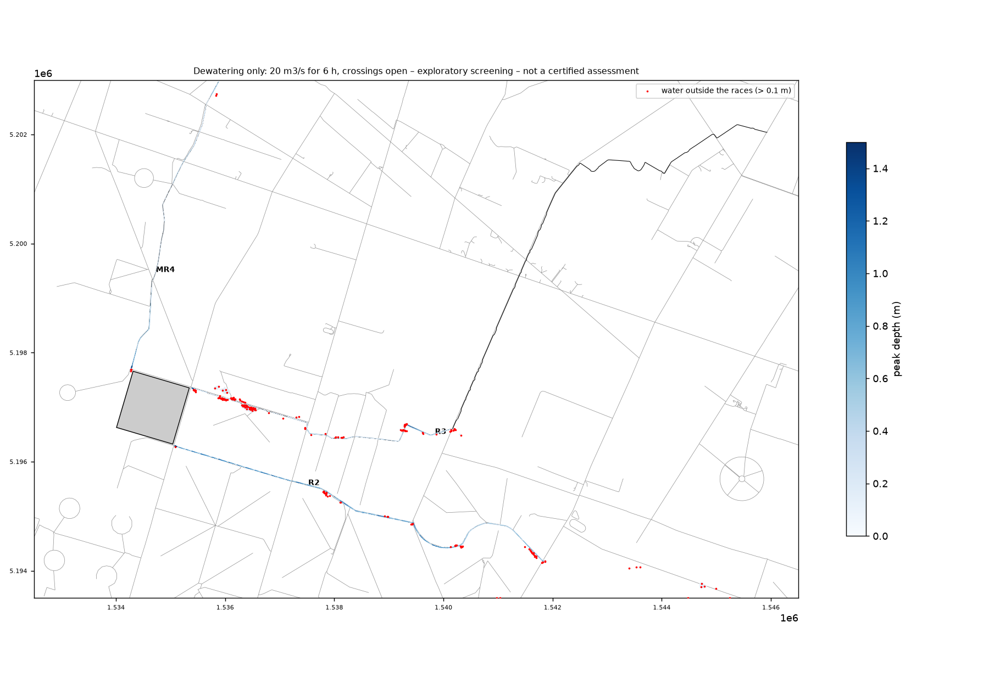
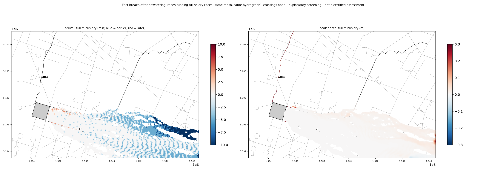
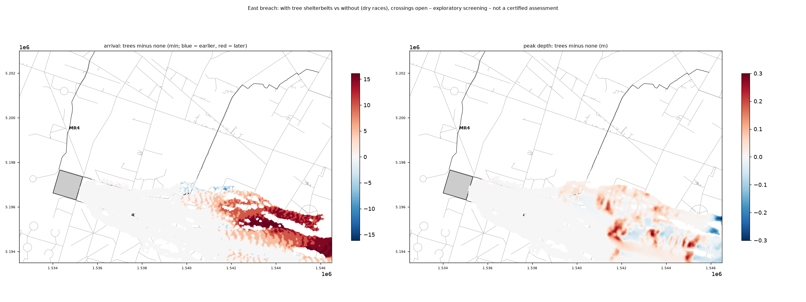
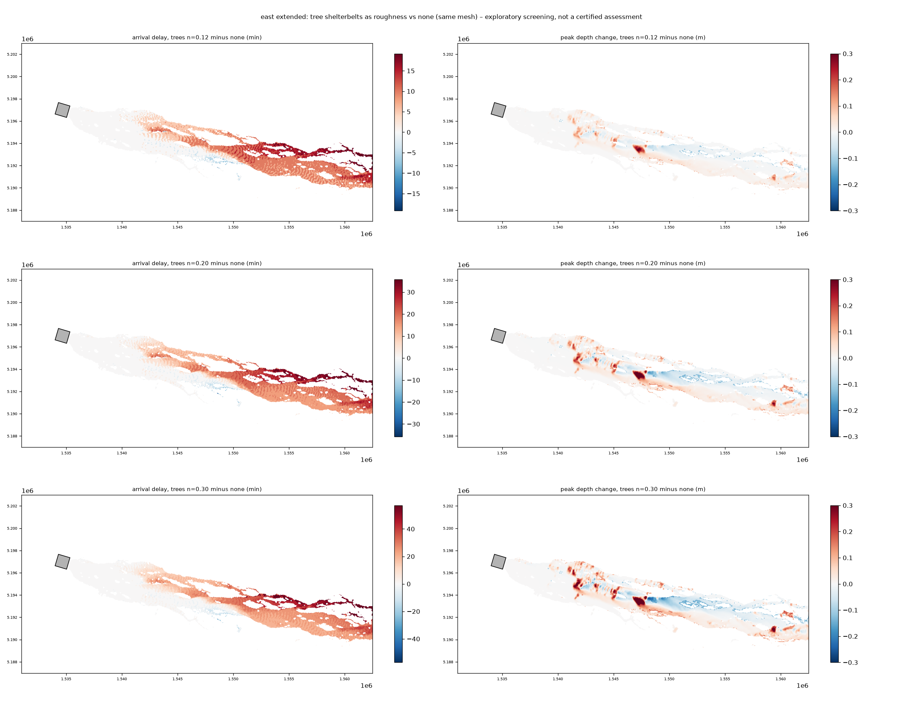

# Water races, dewatering and tree shelterbelts in the 2D model – exploratory runs

**Status: exploratory, not part of the published results.** Nothing in the main pipeline (scripts 01–10),
`config/dam.yaml`, `config/site.yaml`, the viewers or `RESULTS.md` depends on this. Screening model, not a
certified assessment. Companion to [dewatering-drawdown-sensitivity.md](dewatering-drawdown-sensitivity.md)
(breach hydrograph after dewatering) and [dewatering-pathway-evidence.md](dewatering-pathway-evidence.md).

Questions:

1. If the ponds are dewatered at the EAP rates for 6 h, do the races carry it, and where do they spill?
   (The case EAP App. F.6 promises maps for.)
2. If the ponds then fail anyway (east breach), does it matter that the races are already running full?
3. What do the tall (> 10 m) tree shelterbelts do to the breach flood?

## Set-up

* **Domain**: near field, 14 × 9.5 km (`config/races.yaml`), 2 m DEM from the LINZ 1 m LiDAR, 3,000 m² background
  triangles, ~124,000 triangles in total. East breach hydrograph after 6 h of dewatering at the high EAP rates with
  the ponds assumed to fail anyway (1,973 m³/s peak, 6.75 Mm³ – script 11 `--write-hydrograph 6`). 6 h of
  dewatering, then 4 h of breach flood; ANUGA DE0; n = 0.045 (races 0.030).
* **Races**: OSM has them as unnamed `stream`/`drain` ways and the LiDAR resolves the channels. Our ASSUMED match
  to the EAP names (to be confirmed by WIL):

  | Race | OSM chain | In domain | LiDAR channel | Rough bank-full | Dewatering flow |
  |---|---|---|---|---|---|
  | MR4 | north from the NW corner (EAP: "about 6.3 km … to the Eyre", "about 8 culverts" – the LiDAR shows 8 crossings at mapped roads) | 5.6 km, only 4 m fall | ~8 m wide, 1.7 m deep | ~11 m³/s | 5 m³/s |
  | R2 | east-south-east from Wrights Road along the south side | 7.7 km, 54 m fall, stepped (drop structures) | ~9 m wide, 1.3–2 m deep | ~48 m³/s | 10 m³/s |
  | R3 | Dixon Road drain from the Wrights/Dixon corner | 15 km, 64 m fall | ~5 m wide, ~0.8 m deep | ~4–6 m³/s | 5 m³/s |

  EAP Table F.1 gives 5 m³/s via MR4 and 15 m³/s via R2+R3; the 10/5 split is our assumption. LiDAR does not
  penetrate water, so the "bed" is the water surface on the survey day: real capacities are somewhat higher.
  The ponds post-date the LiDAR; the chains start just outside the (approximate) footprint.
* **Races in the mesh** (`damflood/races.py`): the OSM line is snapped to the LiDAR thalweg every 5 m and smoothed;
  crossings are found where the bed rises > 0.4 m above the downstream-falling envelope (road and track fills,
  structures); the bed is burned into the DEM and the two bed-edge lines are mesh breaklines, so the channel
  triangles sit flat on the bed (~5 m triangles along 28 km of race). A single centre-line breakline does NOT
  work: every channel triangle then has a vertex on the bank, the bed is lifted by 1/3–2/3 of the bank height and
  a small race is choked (first attempt: MR4 moved 0.6 km in 6 h; with bed edges 2.2 km in the first hour).
* **Culverts**: `--crossings open` cuts the bed through every fill (culverts and bridges flow freely);
  `--crossings blocked` leaves the LiDAR fill (every culvert blocked). Both have been run for the dewatering-only case; the breach runs use `open`.
* **Shelterbelts** (`damflood/shelterbelts.py`, `--shelterbelts`): canopy height = LINZ 1 m DSM − DEM ≥ 6 m,
  buildings, wires and single trees removed: 3.6 km² = 2.7 % of the domain, median height 13.8 m, 76 % above
  10 m. Sparse near the ponds (pivot irrigation), dense east of about Carleton Road. Each triangle gets an
  equivalent n (n² area-weighted, since head loss ∝ n² × length) with n = 0.20 under trees (bracket 0.12–0.30):
  12,700 triangles affected, median n 0.09 there. Trunks, fences and debris acting as a porous wall are NOT
  modelled – this is the mild end.

Run: `scripts/12_run_races.py --case dewater|dewater_breach|breach_dry [--shelterbelts]` (25–55 min each), then
`scripts/13_races_compare.py` → `outputs/races/`. Animated 3D views: `scripts/14_export_races_webgl.py --run <run>` →
`outputs/races/viewer/<run>/` (a patched copy of `webgl/index.html` with the races and tree blocks; serve the folder with
the `races-viewer` entry of `.claude/launch.json`). Tests: `tests/test_races.py`, `tests/test_shelterbelts.py`.

## Results (culverts open)

### 1. Dewatering only – 20 m³/s for 6 h

* **MR4** carries 5 m³/s: front at the domain edge (5.6 km, towards the Eyre) after 3.4 h, ~0.5 m deep.
* **R2** carries 10 m³/s easily: end of the mapped chain (7.7 km) after 2.3 h, ~0.9 m deep. Where the OSM chain
  ends the model has nowhere to send the water, so the spill there is an artefact of the mapping, not a finding.
* **R3 does not carry 5 m³/s**: it spills along Dixon Road within the first 1–2 km and the front stalls about
  5.9 km down after 6 h. 0.12 km² wet outside the races, up to 0.7 m deep (paddock ponding beside the drain).
* Long sections: `outputs/races/dewater_long_sections_open.png`.

So at screening level the EAP rates fit MR4 and R2 *if every culvert flows freely*; the Dixon Road drain is
too small for a third of Pond 2's dewatering flow. With R3 that small, R2 would need to take ~15 m³/s (it has the
room), or R3 has been / would need to be enlarged – a question for WIL. The blocked-culvert case (EAP F.4–F.5:
culverts are the likely blockage points) is the obvious next run.

#### Every culvert blocked (the other bound)

| Race | Culverts open | Every culvert blocked |
|---|---|---|
| MR4 (5 m³/s, 5.6 km) | domain edge after 3.4 h | **stalls 1.7 km down** – only 4 m of fall, so each blocked fill ponds the race and it spills sideways |
| R2 (10 m³/s, 7.7 km) | end after 2.3 h | end after 3.8 h – steep and deep enough to overtop each fill and drop back into the channel |
| R3 (5 m³/s, 15 km) | front at 5.9 km, spills along Dixon Road | front at 5.3 km, same spill pattern |
| Water outside the races | 0.12 km², up to 0.7 m | 0.19 km², up to 0.7 m |

Blocked culverts matter most on the flat MR4 (the Pond 1 route): dewatering that way effectively stops 1.7 km
from the ponds. The EAP's concern about culverts (F.4–F.5) is borne out for MR4, much less so for R2.
Map / long sections: `outputs/races/dewater_max_depth_blocked.png`, `dewater_long_sections_blocked.png`.

### 2. East breach onto races running full vs dry races

| Road | First arrival, dry races | races full | Peak depth (both) |
|---|---|---|---|
| Wrights Road | 0.18 h | 0.30 h* | 1.90 m |
| Carleton Road | 0.83 h | 0.83 h | 2.38 m |
| Wolffs Road | 1.33 h | 1.33 h | 2.15 m |
| Poyntzs Road | 1.92 h | 1.92 h | 0.79 m |
| Pesters Road | 2.34 h | 2.33 h | 0.54 m |

\* where the road crosses R2/R3 the ground is already wet, and arrival is counted as 0.1 m above the pre-breach depth.

**It makes practically no difference.** Flooded area 26.3 vs 26.0 km²; peak depths +0 to +2 cm; 12 % of the
flooded cells are reached one output step (5 min) earlier, mostly in the far east of the domain, none later by
more than that. (The stripes in the arrival map are the 5-minute output interval, not a physical pattern.)
20 m³/s in the races is 1 % of the 1,973 m³/s breach peak, and the races' storage is a few 10,000 m³ against
6.75 Mm³. The same holds with shelterbelts switched on.

### 3. Tree shelterbelts vs none (east breach, dry races)

* No effect for the first ~6 km (few belts west of Carleton Road); east of about 1541 km E the front is
  **5–15 minutes later** and the delay grows downstream (22 % of flooded cells ≥ 5 min later; Pesters Road
  2.34 → 2.42 h).
* Water backs up behind belts: peak depth **+0.1 to +0.3 m upstream** of dense belts and slightly lower
  downstream (Poyntzs Road 0.79 → 0.89 m, Pesters Road 0.54 → 0.64 m); the flood spreads a little wider
  (+0.3 km²).
* This domain stops 14 km from the ponds; Damwatch's far-field times (Two Chain Road, Diversion Road) lie
  beyond it, where the belts are densest, so the delay there should be larger. With n = 0.20 and no debris
  blockage this is the mild end of the bracket.

### 4. Shelterbelts on the full domain to Diversion Road (east breach, `extended` tier)

`scripts/15_canopy_fraction.py --mode extended` (15.7 km² of canopy = 3.1 % of the domain, median height 12.5 m),
then `scripts/16_run_shelterbelts.py --mode extended [--no-trees | --tree-n 0.12|0.20|0.30]` – the standard east
run (published hydrograph 2,098 m³/s, 20 m DEM, n = 0.045) with the equivalent tree roughness per triangle, plus a
no-tree baseline on the identical mesh (today's mesh has 201,000 triangles; the published extended run had
272,000, so it is not differenced against directly). Standard post-processing via `05`/`06 --tag _trees…`;
summary by `scripts/17_shelterbelts_compare.py` → `outputs/east/shelterbelts_extended.{csv,png,json}`.

First arrival (h after the Pond 2 breach):

| Road | Damwatch 2016 | no trees | trees n = 0.12 | n = 0.20 | n = 0.30 |
|---|---|---|---|---|---|
| Carleton Road | 1.50 | 0.81 | 0.81 | 0.81 | 0.81 |
| Wolffs Road | 2.08 | 1.33 | 1.33 | 1.33 | 1.33 |
| Poyntzs Road | 2.67 | 1.92 | 1.92 | 1.92 | 1.92 |
| Pesters Road | 3.00 | 2.33 | 2.33 | 2.42 | 2.42 |
| Downs Road | 4.17 | 3.39 | 3.42 | 3.42 | 3.42 |
| Browns Road | 5.25 | 4.36 | 4.53 | 4.67 | 4.75 |
| Two Chain Road | 7.33 | 5.50 | 5.60 | 5.75 | 5.83 |
| Diversion Road | 9.00 | 7.58 | 7.83 | 8.04 | 8.23 |

* Nothing changes for the first ~8 km (few belts); from Browns Road on the delay builds to **15–40 minutes at
  Diversion Road**. Over the flooded area the median delay is 5 / 10 / 13 min and the 95th percentile 15 / 30 /
  45 min for n = 0.12 / 0.20 / 0.30; in the far field (last quarter to be reached) 10 / 20 / 26 min.
* That closes roughly 20–45 % of the gap to Damwatch's Diversion Road time (7.58 → 8.23 h vs 9.0 h), but none of
  the gap at Carleton–Poyntzs Roads, which must come from something else (breach formation, grid, road
  embankments – SPEC §4).
* Depths: mostly within ±0.05–0.1 m; locally more behind dense belts (Downs Road 1.17 → 1.34–1.59 m). Flooded
  area is unchanged (64.7 km²).

## What this suggests

* **Races / dewatering**: not worth carrying into the breach scenarios – pre-filled races do not change the
  breach flood. The dewatering-only case is worth keeping as its own (small, fast) scenario because it answers
  the EAP F.6 question; it needs the blocked-culvert run and, ideally, WIL's race and culvert data.
* **Shelterbelts**: worth bringing into the main model as an optional friction layer – a measurable, physically
  sensible far-field delay (15–40 min at Diversion Road) that moves the results towards the slower Damwatch
  times, with local depth increases behind dense belts. It does not explain the near-field difference.

## Limitations

Race names, the R2/R3 flow split and constant dewatering rates are assumptions; beds are LiDAR water surfaces;
culverts are either fully open cuts or fully blocked (no capacity-limited culverts); R3 is meshed 3 m wide (~2 m on
the LiDAR); the R2 OSM chain ends inside the domain; the pond footprint is approximate; arrival times resolve to
the 5-minute output step; one mesh, one roughness value for trees; no infiltration.
