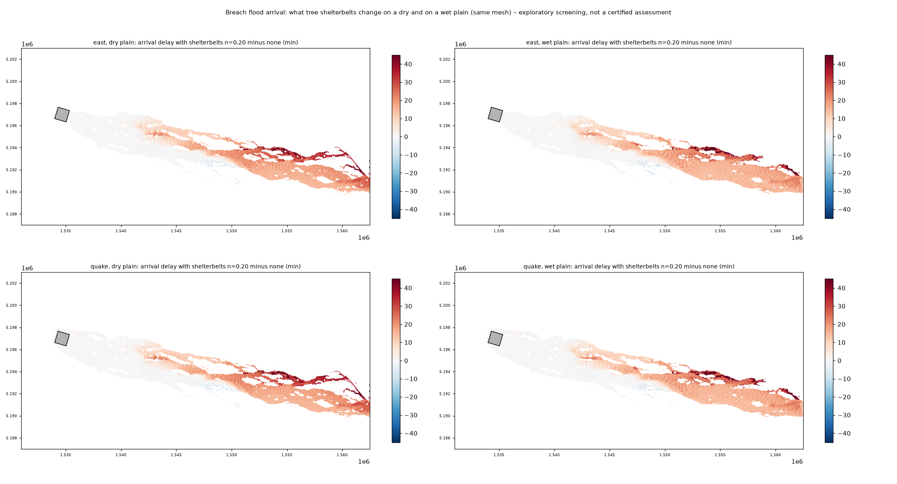
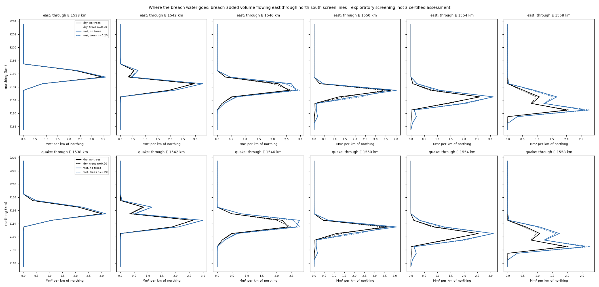
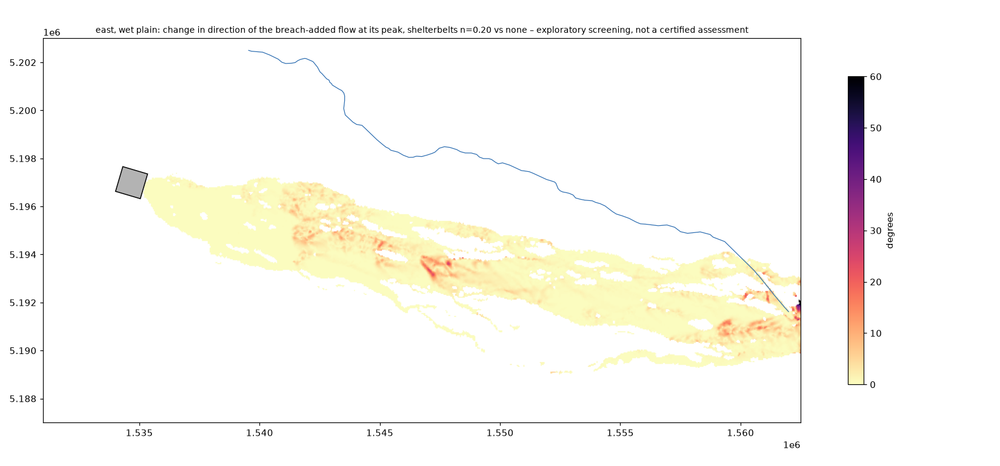
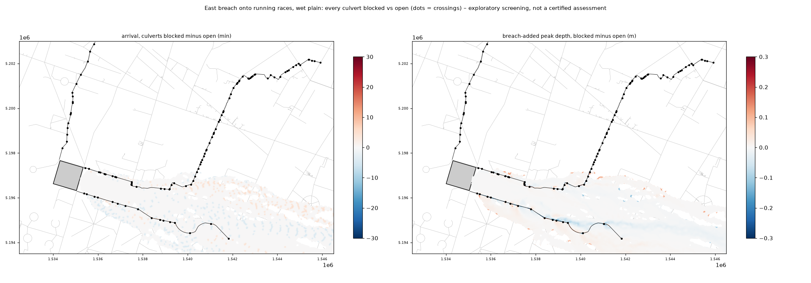
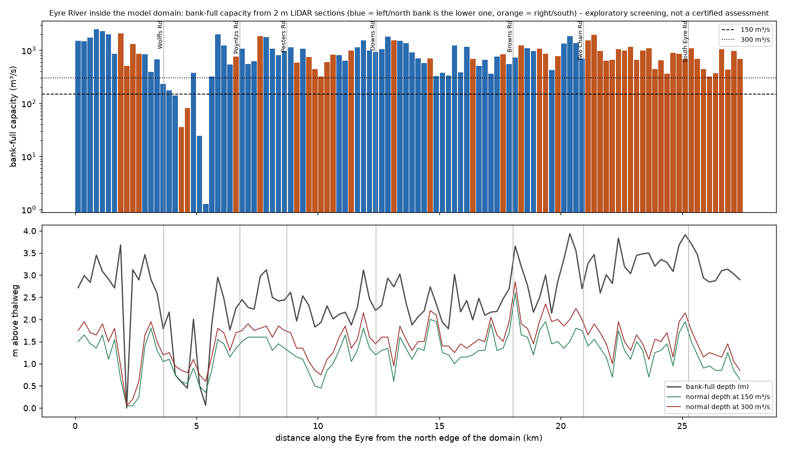
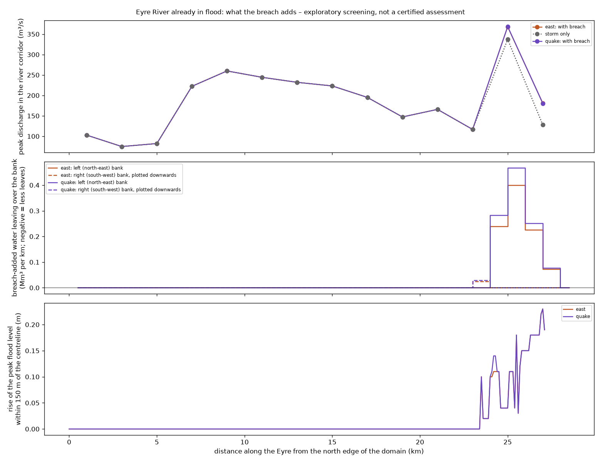

# Shelterbelts, water races and the Eyre River in the worst case: days of rain, river in flood, then a breach or an earthquake

**Exploratory screening, not a certified assessment.** Kept apart from the pipeline (scripts 01–10) and from `RESULTS.md`
like the other exploratory work ([races-and-shelterbelts-2d.md](races-and-shelterbelts-2d.md),
[dewatering-drawdown-sensitivity.md](dewatering-drawdown-sensitivity.md)). 20 Sep 2026.

The questions, as they are put to us:

1. How do tree shelterbelts and water races affect the breach flow – especially when it has been raining for days, the
   Eyre River is in flood, and the breach (or an earthquake) comes at the worst possible time?
2. Do belts, races and culverts change where the water GOES, not only when it arrives?
3. Does water added to an Eyre that is already full – from the races, or from the breach itself – change the river, or make
   it break a bank?

## Short answers

| Question | Answer (screening level) |
|---|---|
| Is a wet plain worse than a dry one? | **Yes, and by more than anything the trees or races do.** On a wet plain the flood front loses nothing to filling hollows and wetting dry ground: it reaches Diversion Road in **6.25 h instead of 7.5 h** (east cascade breach), and 6.8 Mm³ of the 7.2 Mm³ released passes the E 1558 km line instead of 4.5 Mm³. The area the breach adds is 74 km² (dry: 68 km²). Near the ponds nothing changes (Carleton to Poyntzs Road within 5 min). |
| Earthquake (all five embankments at once) on top? | Downstream it looks like the east breach 10–15 min sooner (Diversion Road **6.1 h**), because the east breach still takes ~80 % of the water. The real difference is warning time: no 2.2 h Pond 1 → Pond 2 stage and no sirens. Measured from the initiating event the wet-plain earthquake case reaches Diversion Road in ~6 h, the dry-day cascade in ~9.7 h. |
| Do the shelterbelts still slow it down when everything is wet? | **Yes, by almost the same amount**: +24 / +30 min at Diversion Road for n = 0.20 / 0.30 under trees (dry: +25 / +35 min). Median delay over the flooded area 10–15 min, nothing west of about Carleton Road. They give back about a third of what the wet ground takes away. Price: +0.1–0.15 m behind dense belts over 5–9 km², and 1–2 km² more ground wet. |
| Do the belts steer the flood somewhere else? | **No.** The direction of the breach flow at its peak turns by a median 0.3–0.5°, by more than 20° at 0.1–0.6 % of points; the volume through six north–south screen lines moves 50–110 m south at most; 0.04–0.6 Mm³ of ~7 Mm³ changes its 1 km band. Trees hold water back, they do not redirect it. |
| Do the races and culverts matter to the breach when it is wet? | **No – less than on a dry day.** Every culvert blocked vs every culvert open changes breach arrival by 0–4 min and breach-added depth by ±0.02 m (5th–95th percentile); 0.3 km² of 28 km² is ≥ 0.1 m deeper or shallower, all within a paddock or two of a crossing (up to +0.5 m at the Dixon Road drain crossings). Race flow is 1 % of the breach peak; the flood runs over the road fills. Blocked culverts matter for the dewatering flow itself, not for the breach (§4). |
| Dewatering down the races into an Eyre in flood? | 10 m³/s reaches the Eyre (MR4 5, R3 5; R2 does not reach it). On 150 m³/s that raises river discharge by 1–8 m³/s; the river is already over its banks in places, so practically all of the 0.5 Mm³ added over 14 h leaves over the banks where the storm flow already does (+0.44 Mm³ left, +0.47 Mm³ right on 11.3 / 7.1 Mm³). Flood level up by ≤ 0.18 m, 0.7 km² pushed over the 0.1 m mark. No new spill location. |
| Does the BREACH make the Eyre break a bank? | **Not in this model.** The breach flood runs south of the river and only meets it 23.5 km down the modelled reach, in the last 4 km before the domain edge by Diversion Road. There it adds ≤ 60–80 m³/s to a corridor carrying 130–340 m³/s, raises the peak flood level by **≤ 0.23 m over 2.6 km**, and adds ~0.9–1.1 Mm³ to water that already crosses the left (north-east) bank line there in the storm alone (8 Mm³). No reach spills ONLY because of the breach. Upstream of km 23 the river does not notice the breach at all. |
| Where is the Eyre tight? | LiDAR sections (no 2D model): bank-full capacity is mostly 550–1,100 m³/s (median 830), but **4.1–5.4 km below the north edge of the domain (E 1542900–1543550, N 5200250–5201200) it drops below 150 m³/s** – a narrow channel along a terrace with low ground on one side. That is where R3 joins (E 1542769 N 5201337). A 150 m³/s flood leaves the mapped channel there with or without the dam; this is the place to ask WDC / ECan about. |
| What if the Eyre flood is twice as big (300 m³/s)? | The river alone then wets 17 km² more and is up to 2.5 m deeper; bank outflow doubles (25 / 20 Mm³). What the breach adds stays the same or shrinks (rise ≤ 0.20 m, +0.9 Mm³ over the left bank): **the river flood dominates the river corridor, the breach dominates its own corridor, and they overlap only near Diversion Road.** |

What this does NOT answer is listed in §6 – above all an Eyre flood reaching the north embankment of the ponds (that reach of
the river is outside the model), and belts acting as debris dams.

## 1. Set-up

`scripts/18_run_wet_worstcase.py` is script 04/16 with three independent switches – which breach, wet or dry, trees or not:

* **breach**: `east` (Pond 1 → Pond 2 cascade → Wrights Road side, 2,098 m³/s, 7.18 Mm³) or `quake` (all four external
  embankments and the dividing embankment at once, formation time halved, 3,001 m³/s, 7.43 Mm³, no warning). Hydrographs
  exactly as published (script 03).
* **wet**: the `hydrology:` block of the `storm` scenario – 10 mm/h on the whole domain with no infiltration (saturated
  ground), the Eyre at 150 m³/s where it enters the domain, 2 h of both before the breach opens and all through the 12 h
  after. Every breach inlet is held back by the spin-up (script 04 does this only for single-breach scenarios, which is why
  `quake` + `storm` could not simply be combined there). `--no-breach` gives the same storm without the breach **on the same
  mesh with the same roughness**; breach arrival and "breach-added" depth are measured against it (script 05
  `--baseline-sww`), so rain and river water do not count as the flood arriving.
* **trees**: canopy-fraction roughness as script 16 (`shelterbelts.fraction_friction`, moved out of script 16), n = 0.20 and
  0.30 under canopy; 0.30 is the debris-leaning end of the bracket.
* Full domain to Diversion Road (`--mode extended`, 20 m DEM), plus a mesh refinement strip ±400 m along the Eyre at
  1,000 m² (corridor 3,000, elsewhere 6,000) → 227,624 triangles; ~1–1.5 h per wet run. 21 runs:
  3 storm-only baselines, east and quake × dry / wet × none / 0.20 / 0.30, and for east at n = 0.20 the Eyre doubled
  (`--river-q-factor 2`) and the race dewatering flow added (`--race-outfalls`), each with its own baseline.
* Check: the same script on the shakedown domain without the Eyre strip reproduces the published `storm` run
  (56.6 km² total / 43.8 vs 43.4 km² breach-added; Carleton 0.77 h, Wolffs 1.32 h, Pesters 2.21 vs 2.20 h, Downs 3.13 h).

`scripts/19_wet_compare.py` does the comparisons; `scripts/20_eyre_capacity.py` the river sections; settings in
`config/wet.yaml`; helpers in `damflood/wet.py` (tests: `tests/test_wet.py`).

## 2. Wet vs dry, trees vs none

First arrival of the breach water, hours after the external breach opens (`outputs/wet/wet_roads_extended.csv`):

| Road | east dry | + trees 0.20 / 0.30 | east wet | + trees 0.20 / 0.30 | quake dry | quake wet | + trees 0.20 / 0.30 |
|---|---|---|---|---|---|---|---|
| Carleton | 0.82 | 0.82 / 0.82 | 0.75 | 0.75 / 0.75 | 0.65 | 0.65 | 0.65 / 0.65 |
| Wolffs | 1.33 | 1.33 / 1.33 | 1.33 | 1.33 / 1.33 | 1.08 | 1.08 | 1.08 / 1.08 |
| Poyntzs | 1.92 | 1.92 / 1.92 | 1.83 | 1.83 / 1.83 | 1.58 | 1.58 | 1.58 / 1.58 |
| Pesters | 2.31 | 2.33 / 2.39 | 2.23 | 2.25 / 2.31 | 2.00 | 1.92 | 2.00 / 2.00 |
| Downs | 3.33 | 3.42 / 3.42 | 3.17 | 3.18 / 3.18 | 3.08 | 2.83 | 2.92 / 2.92 |
| Browns | 4.37 | 4.67 / 4.75 | 3.92 | 4.17 / 4.25 | 4.17 | 3.67 | 3.95 / 4.00 |
| Two Chain | 5.42 | 5.75 / 5.83 | 4.76 | 5.00 / 5.08 | 5.25 | 4.58 | 4.83 / 4.92 |
| **Diversion** | **7.49** | 7.90 / 8.08 | **6.25** | 6.65 / 6.75 | 7.33 | **6.08** | 6.48 / 6.58 |

(Damwatch 2016, east breach, dry day: Diversion Road 9.0 h. Add 2.2 h to the east columns for time since the Pond 1 failure;
nothing to the quake columns.)

| | east dry | east wet | quake dry | quake wet |
|---|---|---|---|---|
| Area the breach floods > 0.1 m (km²), no trees | 68.2 | 74.2 | 70.5 | 77.4 |
| … with trees n = 0.20 / 0.30 | 68.3 / 68.1 | 75.3 / 76.2 | 70.8 / 70.7 | 78.4 / 79.3 |
| Tree delay, median / 95th percentile (min), n = 0.20 | 10 / 30 | 10 / 25 | 6 / 30 | 10 / 25 |
| … n = 0.30 | 14 / 45 | 15 / 36 | 10 / 45 | 11 / 37 |
| Tree delay in the last quarter reached (min), n = 0.20 / 0.30 | 20 / 27 | 15 / 24 | 20 / 27 | 16 / 24 |
| Depth change by trees, 5th / 95th percentile (m), n = 0.20 | −0.05 / +0.12 | −0.05 / +0.12 | −0.04 / +0.11 | −0.05 / +0.11 |
| Area ≥ 0.1 m deeper / shallower with trees (km²), n = 0.30 | 6.1 / 2.6 | 9.0 / 3.2 | 5.8 / 2.3 | 8.6 / 3.1 |
| Total wet > 0.1 m incl. rain and river (km²) | – | 152 | – | 154 |

Reading: the expectation was that trees matter less on a wet plain. They matter slightly less in the far field (15 vs 20 min)
but the difference is small – roughness acts on the flowing water, not on the wetting front. What the wet plain changes is
the front itself: hollows, drains and paddock depressions that swallow the first water on a dry day are already full.
The storm alone wets 100 km² of the 504 km² domain deeper than 0.1 m under this (harsh) rain assumption (109 km² with
n = 0.30 belts, which also hold back rain runoff), so totals are dominated by rain – use the breach-added figures.



## 3. Do the belts redirect the flow?

From run pairs on the identical mesh (`redirect` in `outputs/wet/wet_compare_extended.json`): the breach-added unit discharge
vector (run minus storm-only baseline) at the time its size peaks, trees vs none, and the breach-added volume through
north–south screen lines at E 1538 … 1558 km in 1 km bands of northing.

| | east wet 0.20 | east wet 0.30 | quake wet 0.30 | east dry 0.30 |
|---|---|---|---|---|
| Direction change, median / 90th / 99th percentile (°) | 0.3 / 3.2 / 12 | 0.5 / 4.3 / 16 | 0.4 / 4.0 / 15 | 0.4 / 3.6 / 12 |
| Points turned by more than 20° / 45° | 0.3 % / 0 | 0.6 % / 0 | 0.5 % / 0 | 0.2 % / 0 |
| Peak unit flow, trees / none, 5th–95th percentile | 0.70–1.18 | 0.61–1.23 | 0.63–1.21 | 0.62–1.27 |
| Largest volume moved between 1 km bands (Mm³ of ~6.8) | 0.41 at E 1550 | 0.60 at E 1550 | 0.57 at E 1550 | 0.43 at E 1550 |
| Shift of the flow centroid | 7–68 m south | 11–98 m south | 5–98 m south | 20–108 m south |

Locally the flow is slower in a belt and faster in the gaps beside it (±20–40 %), which is what raises depths behind belts,
but the flood path as a whole does not move. 


## 4. Races and culverts, dry and wet

Near-field race domain (14 × 9.5 km, 2 m DEM, MR4 / R2 / R3 in the mesh; `scripts/12_run_races.py --tag _cmp`): 6 h of
dewatering down the races (20 m³/s), then the east breach, with **every culvert open** (cut through the road fills) against
**every culvert blocked** (LiDAR surface) – once on a dry plain, once with 10 mm/h rain throughout, the wet pair measured
against the same runs without the breach (`scripts/21_races_wet_compare.py`, `outputs/races/culverts_summary.json`).

| Blocked minus open | dry plain | wet plain |
|---|---|---|
| Area the breach floods (km²), open / blocked | 27.82 / 27.90 | 28.08 / 28.16 |
| Flooded only with blocked / only with open culverts (km²) | 0.18 / 0.10 | 0.14 / 0.05 |
| Arrival change, 5th / 50th / 95th percentile (min) | −4 / 0 / +2 | −2 / 0 / +1.5 |
| Breach-added depth change, 1st / 5th / 50th / 95th / 99th percentile (m) | −0.08 / −0.02 / 0 / +0.02 / +0.09 | −0.06 / −0.02 / 0 / +0.01 / +0.03 |
| Area ≥ 0.1 m deeper / shallower (km²) | 0.27 / 0.25 | 0.16 / 0.15 |
| Largest change within 80 m of a crossing | +0.5–0.7 m at three R2 crossings (E 1537.8–1539.4 km) and the R3 crossings at E 1537.5–1537.7 km | +0.4–0.5 m at the R3 (Dixon Road drain) crossings E 1537.5–1539.9 km |
| Road arrivals (Carleton / Wolffs / Poyntzs / Pesters) | unchanged (0.83 / 1.33 / 1.92 / 2.33 h) | unchanged but Poyntzs 1.92 → 1.84 h |

Reading: whether the culverts flow or are blocked is a **local** matter – a few tenths of a metre within a paddock or two of a
crossing, about 0.3 km² in 28 – and makes no difference to when or where the breach flood goes. The breach is 100 times the
race flow and simply runs over the road fills. On a wet plain the difference is smaller still, because the ground either
side of each fill is already wet. (The road table shows a lower peak depth at Carleton and Wolffs Road with blocked
culverts, 2.1 → 1.2 m and 1.4 → 1.0 m: that is the depth in the race cut itself where it is opened through the road, not
water on the road.) What blocked culverts DO matter for is the dewatering flow on its own – MR4 stalls 1.7 km from the
ponds ([races-and-shelterbelts-2d.md](races-and-shelterbelts-2d.md)). 

## 5. The Eyre River

Where things are (OSM + `config/races.yaml` chains): 27–29 km of the Eyre lie inside the full domain, entering at the north
edge (E 1538.6 km) and leaving at the east edge by Diversion Road. **MR4** ends ~225 m from the Eyre at E 1536065 N 5203236,
just north of the domain edge (its flow is added to the river inlet); **R3** meets the Eyre at E 1542769 N 5201337, 11.1 km
down the race; **R2**'s mapped chain stops 5.4 km short of the river (mapping artefact). The reach of the Eyre beside the
ponds is outside the domain.

**Capacity from LiDAR sections** (`scripts/20_eyre_capacity.py`, 110 sections of the 2 m DEM, ±400 m, Manning n 0.035, slope
~0.006): bank-full capacity 5 / 25 / 50 / 75th percentile = 200 / 550 / 830 / 1,130 m³/s; 5 sections below 150 m³/s and
7 below 300 m³/s, all between km 3.6 and 5.4 – see the table in the short answers. The lower bank is the left (north-east)
one at 55 % of sections. 

**2D, storm only**: the modelled corridor (±400 m) carries 75–260 m³/s along the river and up to 340 m³/s at km 25 where
plain runoff joins; 13 Mm³ crosses the left bank line and 9 Mm³ the right one in 12 h, i.e. in this storm the river and the
runoff on the plain are one system long before any breach.

**What the breach adds** (breach minus storm-only, no trees; `eyre` in the JSON):

| | east | quake |
|---|---|---|
| First river km reached by breach water | 23.5 | 23.5 |
| Largest added discharge in the river corridor | 62 m³/s at km 25, 79 at km 27 | 65 / 75 |
| Added volume passing km 27 | 0.79 Mm³ | 0.84 Mm³ |
| Rise of the peak flood level in the river | ≤ 0.23 m, > 0.1 m along 2.6 km | same |
| Extra water over the left (NE) bank line, km 24–27 | +0.94 Mm³ on 8.0 | +1.08 Mm³ |
| Extra over the right (SW) bank line | none (the breach water arrives from that side) | none |
| Reaches that spill only with the breach | none | none |



## 6. Limits – what this does not show

* **The Eyre beside the ponds is outside the model.** The WDC mapping cited in the design report (major Eyre flood reaching
  the north embankment) and the chain in CLG point 3 are still not represented. A breach into an Eyre flood standing at the
  north embankment would need the domain extended ~7 km north and a real river hydrograph.
* The Eyre flood is a constant 150 m³/s point inflow without a return period (A10), the rain is a steady 10 mm/h for 14 h with no
  infiltration (A9) – harsher than a design storm; the Waimakariri is not in flood (A12). The doubled-Eyre run is a
  sensitivity, not a design case. Get the ECan record (Eyre at Downs Road / Eyrewell) and HIRDS rainfall.
* River banks at 1,000 m² triangles on a 20 m DEM: stopbanks narrower than ~30 m are smoothed, so the 2D model spills too
  readily; the LiDAR capacity profile is the check. Bank **erosion or stopbank failure** is not modelled at all – only where
  and how much water goes over.
* Bank lines are the OSM centreline ± 250 m; where the river bends sharply or plain runoff crosses them, "leaving" includes
  water that was never in the channel. Read differences (with minus without breach), not totals.
* Trees are roughness only (A19): trunks, fences and debris forming a porous wall are not modelled. n = 0.30 is a bracket, not
  a blockage bound; a sill-type upper bound is still open (HANDOVER §8.4).
* Culverts are open or blocked, nothing in between (A17). Race names and the R2/R3 split are assumptions.
* The storm changes nothing about the breach itself: same hydrograph, same 223.6 m cascade trigger (A4). Rain on the ponds,
  wave action or a saturated embankment are not in it.
* Arrival times resolve to the 5-min output step.

## 7. Reproduce

```
python scripts/15_canopy_fraction.py --mode extended
python scripts/18_run_wet_worstcase.py --scenario east --hydrology storm --no-trees --no-breach --mode extended   # baseline
python scripts/18_run_wet_worstcase.py --scenario east|quake [--hydrology storm] --no-trees | --tree-n 0.20 --mode extended
python scripts/05_postprocess.py --scenario east --mode extended --tag _wet_trees020 \
       --baseline-sww outputs/east/east_extended_wet_trees020_nobreach.sww        # baselines and dry runs: no --baseline-sww
python scripts/19_wet_compare.py --mode extended
python scripts/20_eyre_capacity.py
python scripts/12_run_races.py --case dewater_breach --crossings open|blocked [--rain-mm-h 10] --tag _cmp
python scripts/12_run_races.py --case dewater --crossings open|blocked --rain-mm-h 10 --finaltime-s 36000 --tag _cmp
python scripts/21_races_wet_compare.py
```

The no-breach baselines live in `outputs/east/` and serve `quake` too (they do not depend on the breach).
